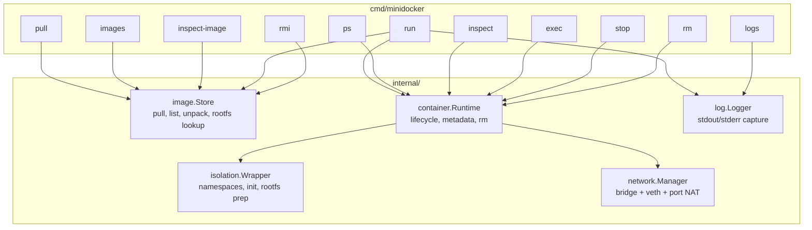
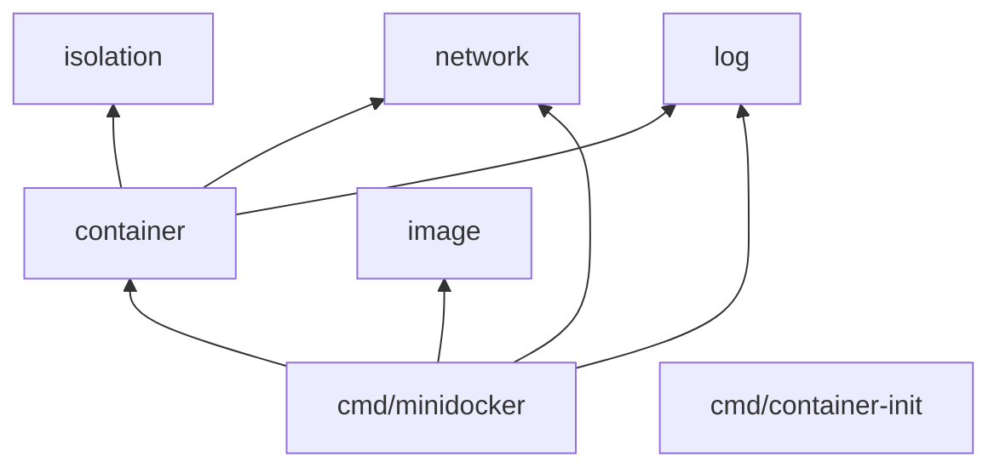
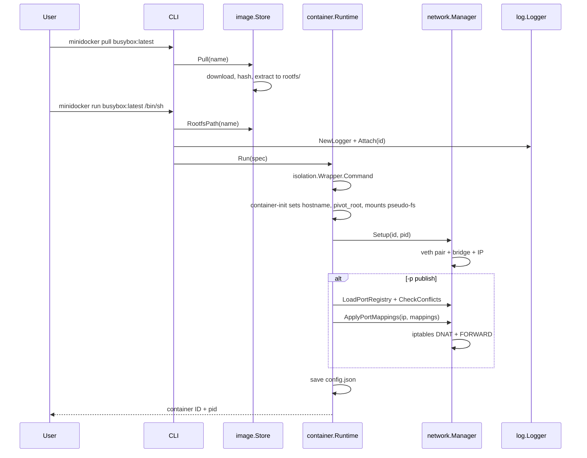
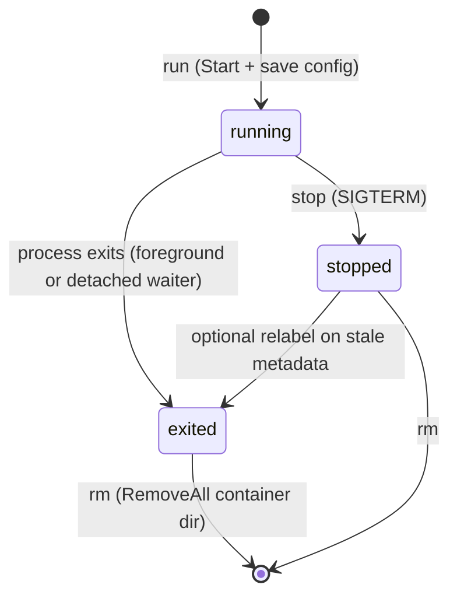
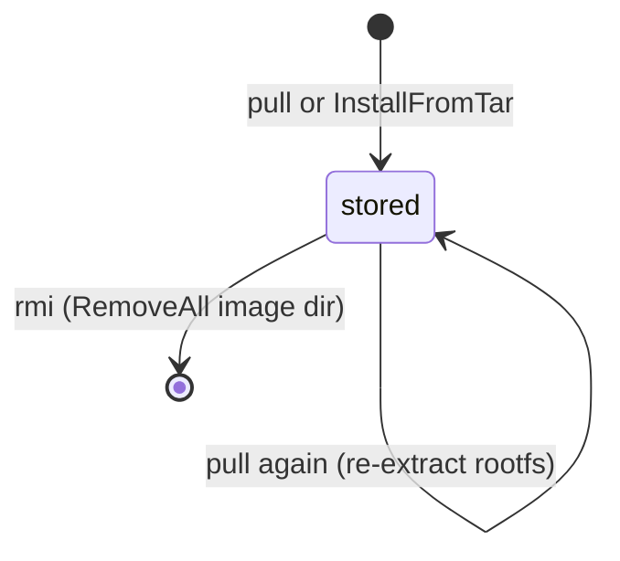
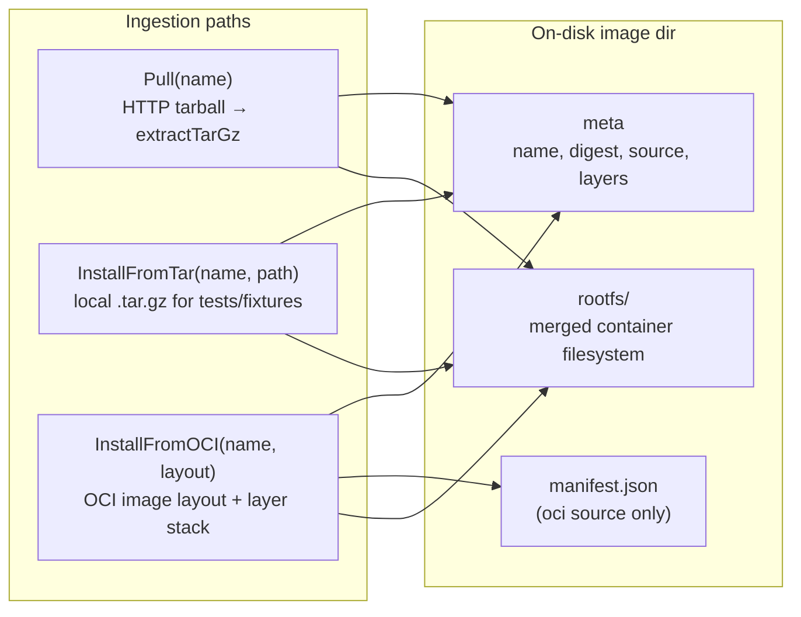
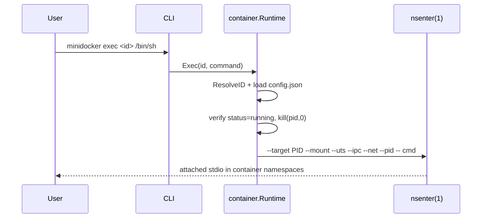

# minidocker

A minimal container runtime for learning how Docker-like tools work under the hood.

minidocker implements the core pieces of a container engine in Go: pulling and storing
images, creating isolated processes with Linux namespaces, attaching simple virtual
networking, and streaming container logs.

## Features

- **Images** — fetch, unpack, and store OCI-style root filesystems locally; list with `images`, inspect layer metadata with `inspect-image`, remove with `rmi`
- **Run** — start processes inside new PID, mount, UTS, IPC, and network namespaces
- **Logs** — capture stdout/stderr from running containers
- **Networking** — create veth pairs and assign IP addresses on a bridge
- **Exec** — attach to a running container's namespaces via `nsenter`
- **Lifecycle** — stop running containers and remove stopped ones with `rm`

## Requirements

- Linux (namespaces; cgroups are not used yet)
- Go 1.22+
- root privileges (for namespace and network setup)

## Quick start

```bash
go build -o minidocker ./cmd/minidocker
go build -o container-init ./cmd/container-init

# Pull a minimal rootfs (busybox-based demo image)
sudo ./minidocker pull busybox:latest

# List images stored locally
sudo ./minidocker images

# Inspect image metadata (digest, source, layers, rootfs size)
sudo ./minidocker inspect-image busybox:latest

# Run an interactive shell
sudo ./minidocker run busybox:latest /bin/sh

# Run detached and publish a port (host traffic forwarded via iptables DNAT)
sudo ./minidocker run -d -p 8080:80 busybox:latest /bin/httpd -f

# Shorthand publish, UDP, and localhost-only bindings are also supported
sudo ./minidocker run -d -p 80 busybox:latest /bin/httpd -f
sudo ./minidocker run -d -p 127.0.0.1:5353:53/udp busybox:latest /bin/udpecho

# View logs from a detached container
sudo ./minidocker logs <container-id>

# Inspect container metadata (JSON)
sudo ./minidocker inspect <container-id>

# Stop and remove a container
sudo ./minidocker stop <container-id>
sudo ./minidocker rm <container-id>

# Remove an unused image from the local store
sudo ./minidocker rmi busybox:latest
```

## Architecture

minidocker is a single-binary, stateless CLI that wires together five core internal
packages. Each invocation constructs fresh `image.Store`, `container.Runtime`, and
`log.Logger` instances rooted at `/var/lib/minidocker/`; there is no long-lived daemon.
The CLI parses commands and delegates to package APIs — it does not implement container
logic itself.

### Component overview



| Package | Responsibility | Default on-disk root |
|---------|----------------|----------------------|
| `image` | Download tarballs, verify SHA-256, extract rootfs, list and remove stored images | `/var/lib/minidocker/images/` |
| `container` | Persist metadata, stop/remove containers, orchestrate run lifecycle | `/var/lib/minidocker/containers/` |
| `isolation` | Namespace flags, `container-init` wrapper, hostname and mount setup | (in-memory / child process) |
| `network` | Bridge `minidocker0`, veth pairs, container IP allocation, iptables port forwarding | (kernel interfaces) |
| `log` | Attach stdout/stderr writers per container | same dir as `container` metadata |

### Package dependencies

Import direction is strict: only `cmd/minidocker` and test helpers reach into
`internal/`. Production packages never import each other in a cycle — `container` sits
at the center and orchestrates `isolation`, `network`, and `log`.



| Package | May import | Must not import |
|---------|------------|-----------------|
| `image` | stdlib only | any `internal/*` |
| `isolation` | stdlib only | any `internal/*` |
| `network` | stdlib only | any `internal/*` |
| `log` | stdlib only | any `internal/*` |
| `container` | `isolation`, `network`, `log` | `image` (rootfs path passed in via `RunSpec`) |

`cmd/container-init` is a separate binary with no `internal/` imports; it only uses
the Go standard library and environment variables set by `isolation.Wrapper`.

### Identifiers and addressing

Container IDs are 12 lowercase hex characters derived from `UnixNano()` at creation
time (`generateID` in `container`). Commands accept ID prefixes: `ResolveID` scans
`containers/` and requires a unique match, otherwise returns an ambiguity error.

Bridge IPs are deterministic from the container ID — the sum of ID bytes selects
`172.17.0.<2–251>` (`network.Manager.allocateIP`). Host veth interfaces are named
`veth` + the first 8 ID characters.

### Host tools

Networking and exec delegate to standard Linux utilities rather than netlink or cgo:

| Tool | Used for |
|------|----------|
| `ip` (iproute2) | Bridge `minidocker0`, veth pairs, addresses, routes |
| `iptables` | Outbound MASQUERADE, `-p` DNAT/FORWARD rules |
| `nsenter` (util-linux) | `exec` namespace attach; in-namespace `ip` during setup |

### Pull → run flow



### Container lifecycle

Containers move through a small set of states tracked in `config.json`:



| State | Meaning | Allowed next commands |
|-------|---------|----------------------|
| `running` | PID alive in namespaces | `logs`, `exec`, `inspect`, `stop` |
| `stopped` | SIGTERM sent; directory kept | `logs`, `inspect`, `rm` |
| `exited` | Process finished | `logs`, `inspect`, `rm` |

`container.Runtime.Remove` resolves ID prefixes (same rules as `inspect`), refuses
containers whose PID still responds to signal `0`, and deletes the entire
`<id>/` directory—including `config.json`, `stdout.log`, and `stderr.log`.

### Image lifecycle

Images are independent of containers: pulling writes under `images/`, while
`run` only reads the unpacked `rootfs/` path. Container metadata records the
image name in `config.json` but does not pin the image directory.



| Stage | On-disk state | Allowed commands |
|-------|---------------|------------------|
| `stored` | `<sanitized-name>/meta` + `rootfs/` | `images`, `run`, `rmi` (if unused) |
| in use | same, plus ≥1 `containers/<id>/` referencing the image name | `images`, `run`; `rmi` refused |

`rmi` checks `container.Runtime.ContainersUsingImage` before calling
`image.Store.Remove`. Any container — running, stopped, or exited — blocks
removal until `rm` deletes its directory. Re-pulling an existing name
overwrites the previous rootfs in place.

### Image store architecture

The `image` package owns everything under `/var/lib/minidocker/images/`. Images
reach the store through three paths; all converge on the same on-disk shape
(`meta` + `rootfs/`):



| Source (`meta`) | How it arrives | Layer metadata | `manifest.json` |
|-----------------|----------------|----------------|-----------------|
| *(empty)* / `pull` | `minidocker pull` downloads a known demo tarball | single implicit layer | no |
| `local` | `InstallFromTar` (tests, offline fixtures) | none recorded | no |
| `oci` | `InstallFromOCI` reads `index.json` + blobs | comma-separated digests in `meta`; full descriptors in `manifest.json` | yes |

**Pull** maps a handful of demo names (`busybox:latest`, `alpine:latest`,
`demo:latest`) to public rootfs tarballs, verifies SHA-256 while downloading,
and extracts with `extractTarGz` (gzip or plain tar). **InstallFromTar** is the
offline equivalent used by integration tests with
`testdata/fixtures/tiny-rootfs.tar.gz`. **InstallFromOCI** follows the
[OCI image layout](https://github.com/opencontainers/image-spec/blob/main/image-layout.md):
read `index.json`, resolve the first manifest blob, apply each layer in order
with `ExtractLayers`, and persist a copy of the manifest beside the rootfs.

Layer application (`internal/image/layer.go`) mirrors Docker overlay semantics:
entries named `.wh.<file>` delete paths from lower layers, and opaque directory
markers (`.wh..wh..`) are skipped. This lets stacked OCI layers remove files
introduced by earlier layers.

Use **`inspect-image`** to dump the merged view without running a container:

```bash
sudo ./minidocker inspect-image busybox:latest
```

Example JSON fields:

| Field | Meaning |
|-------|---------|
| `Name`, `Digest`, `Source` | Parsed from `meta` |
| `Layers` | Layer digests (from `meta` or parsed `manifest.json`) |
| `layer_count` | Number of OCI layers (0 for single-tar pulls) |
| `rootfs_size_bytes` | Total size of regular files under `rootfs/` |

### Exec flow

`exec` does not start a new container. It re-enters the **existing** process
namespaces with `nsenter`:



### On-disk layout

After pulling `busybox:latest` and running one container, state looks like this:

```
/var/lib/minidocker/
├── images/
│   └── busybox_latest/
│       ├── meta                 # name, digest, optional source=local|oci, layers=
│       ├── manifest.json        # present for OCI-loaded images (layer descriptors)
│       └── rootfs/              # unpacked container filesystem
│           ├── bin/
│           ├── etc/
│           └── ...
└── containers/
    └── <12-char-id>/
        ├── config.json          # id, image, command, status, pid, ip, port_mappings, created
        ├── stdout.log           # captured stdout (when logger attached)
        └── stderr.log           # captured stderr
```

Container metadata is JSON (`config.json`) and is written at start, updated on exit,
and read by `ps`, `inspect`, and `stop`. Use `minidocker inspect <id>` to dump the
full record:

```bash
sudo ./minidocker inspect abc123def456
```

### Isolation model

Process isolation lives in `internal/isolation` and is applied through a small
`container-init` helper (`cmd/container-init`). `container.Runtime` delegates
namespace setup to `isolation.Wrapper`, which starts `container-init` as PID 1
inside these `clone(2)` flags:

| Flag | Namespace | Effect |
|------|-----------|--------|
| `CLONE_NEWUTS` | UTS | Separate hostname (set via `sethostname(2)` to container ID) |
| `CLONE_NEWPID` | PID | Process tree isolated from host; init reaps zombies |
| `CLONE_NEWNS` | Mount | Private mount namespace; rootfs via `pivot_root(2)` |
| `CLONE_NEWIPC` | IPC | Separate SysV IPC / POSIX message queues |
| `CLONE_NEWNET` | Network | Dedicated network stack; veth moved in after start |

Inside the new namespaces, `container-init`:

1. Sets the UTS hostname to the container ID
2. Marks mounts `MS_PRIVATE` so changes stay inside the container
3. `pivot_root(2)` into the image rootfs when one is configured (stronger than `chroot`)
4. Mounts standard pseudo filesystems: `procfs`, `tmpfs` on `/dev` and `/tmp`, essential
   device nodes, `devpts`, and read-only `sysfs`
5. Execs the user command with `NoNewPrivileges` and reaps orphaned children until the
   workload exits

Both `container-init` and the user workload are started with `NoNewPrivileges` so
file-based privilege escalation (e.g. setuid binaries) is blocked inside the container.

Place `container-init` next to the `minidocker` binary, or set `MINIDOCKER_INIT`
to its path. Integration tests build the helper automatically.

Networking runs **after** `cmd.Start()` so the child PID is available for
`ip link set … netns /proc/<pid>/ns/net`. The host bridge `minidocker0` uses
`172.17.0.1/16`; each container receives `172.17.0.<n>/24` derived from its ID.

**Port publishing** (`-p`) installs iptables DNAT rules on `PREROUTING` and
`OUTPUT`, plus a `FORWARD` accept rule, so traffic to the host port reaches the
container's bridge IP. Supported publish forms:

| Form | Example | Meaning |
|------|---------|---------|
| Shorthand | `-p 80` | Publish container port 80 on host port 80/tcp |
| Host mapping | `-p 8080:80` | Forward host 8080/tcp to container 80/tcp |
| Bind address | `-p 127.0.0.1:8080:80` | Listen on localhost only |
| UDP | `-p 5353:53/udp` | Forward UDP instead of TCP |

A **port registry** scans existing container metadata before `run` and rejects
conflicting host bindings (including all-interfaces vs localhost conflicts).
Outbound container traffic is NATed via a one-time `MASQUERADE` rule on the
bridge subnet. Port mappings and the assigned IP are persisted in `config.json`
and removed when the container is deleted with `rm`.

### Runtime behavior

- **`run` is foreground by default** — pass `-d` to detach; the CLI returns the
  container ID immediately and a background goroutine waits for exit.
- **Shared container directory** — `container.Runtime` and `log.Logger` both
  use `/var/lib/minidocker/containers/`; each run creates
  `<id>/config.json`, `stdout.log`, and `stderr.log` under the same folder.
- **Best-effort networking** — if veth/bridge setup fails, minidocker prints a
  warning and keeps the container running without external connectivity.
- **Port publish** — `-p` accepts Docker-style publish specs (`80`, `8080:80`,
  `127.0.0.1:8080:80`, `5353:53/udp`). A port registry rejects cross-container
  host-port conflicts before `run` starts the workload. iptables DNAT/FORWARD
  rules are installed after network setup and persisted in `config.json`; `ps`
  shows a `PORTS` column.
- **Offline images** — tests and fixtures load tarballs via
  `image.Store.InstallFromTar` instead of `Pull`; `images` shows `source=local`.
- **Cleanup** — `rm` removes stopped/exited container directories; running
  containers must be stopped first.

### Package map

```
cmd/minidocker/       CLI entry point (pull, images, inspect-image, run, ps, inspect, logs, exec, stop, rm, rmi)
cmd/container-init/   PID 1 helper that prepares rootfs and execs the workload
internal/
  image/              image store, listing, and rootfs extraction
  isolation/          namespace wrapper, clone flags, rootfs preparation
  container/          process lifecycle, metadata I/O, removal
  network/            bridge and veth management, port registry, iptables port forwarding
  log/                stdout/stderr capture
  testutil/           shared helpers for unit and integration tests
testdata/fixtures/    checked-in rootfs tarball for offline tests
```

## How it works

1. **Pull** downloads a tarball, verifies its digest, and unpacks it into
   `/var/lib/minidocker/images/<name>/rootfs`.
2. **Run** uses `isolation.Wrapper` to start `container-init` with `clone(2)`
   namespace flags. The init process sets the hostname, pivots into the image
   rootfs, mounts `/proc`, `/dev`, `/sys`, and `/tmp`, and execs the requested command.
3. **Network** creates a veth pair, moves one end into the container namespace,
   attaches the host end to the `minidocker0` bridge, and optionally installs
   iptables DNAT rules for `-p` port mappings.
4. **Logs** redirect the container's stdout/stderr through a pipe to a log file
   under `/var/lib/minidocker/containers/<id>/`.

## Testing

Unit tests run without root and use the checked-in `testdata/fixtures/tiny-rootfs.tar.gz`
fixture instead of downloading images:

```bash
go test ./...
```

Integration tests exercise the full run path (namespaces, pivot_root, log capture) with the
fixture image and require root:

```bash
sudo go test -tags=integration ./...
```

The `internal/integrationtest` package provides `NewEnv` to install the tiny fixture
image and wire a temp runtime for integration tests. Regenerate the fixture tarball after
changing embedded helpers (`echo`, `readhostname`, `sleep`, `tcpecho`):

```bash
./scripts/build-test-fixture.sh
```

## License

MIT
