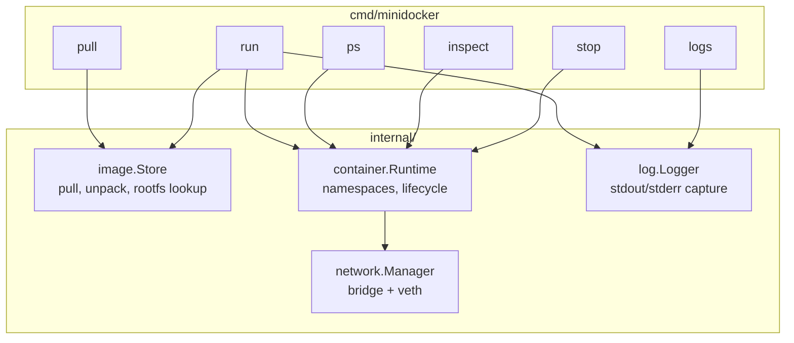
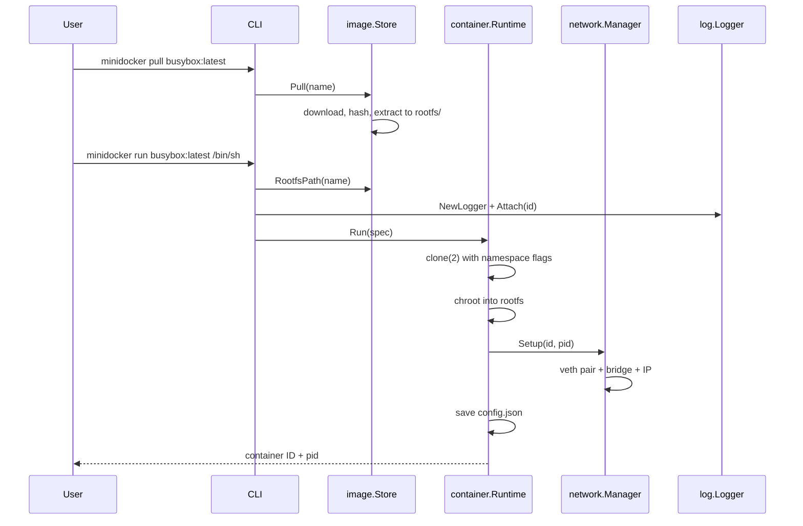

# minidocker

A minimal container runtime for learning how Docker-like tools work under the hood.

minidocker implements the core pieces of a container engine in Go: pulling and storing
images, creating isolated processes with Linux namespaces, attaching simple virtual
networking, and streaming container logs.

## Features

- **Images** — fetch, unpack, and store OCI-style root filesystems locally
- **Run** — start processes inside new PID, mount, UTS, IPC, and network namespaces
- **Logs** — capture stdout/stderr from running containers
- **Networking** — create veth pairs and assign IP addresses on a bridge

## Requirements

- Linux (namespaces and cgroups v2)
- Go 1.22+
- root privileges (for namespace and network setup)

## Quick start

```bash
go build -o minidocker ./cmd/minidocker

# Pull a minimal rootfs (busybox-based demo image)
sudo ./minidocker pull busybox:latest

# Run an interactive shell
sudo ./minidocker run busybox:latest /bin/sh

# View logs from a detached container
sudo ./minidocker logs <container-id>

# Inspect container metadata (JSON)
sudo ./minidocker inspect <container-id>
```

## Architecture

minidocker is a single-binary CLI that wires together four internal packages. The CLI
parses commands and delegates to package APIs; it does not implement container logic
itself.

### Component overview



| Package | Responsibility | Default on-disk root |
|---------|----------------|----------------------|
| `image` | Download tarballs, verify SHA-256, extract rootfs | `/var/lib/minidocker/images/` |
| `container` | Create namespaces, start processes, persist metadata | `/var/lib/minidocker/containers/` |
| `network` | Bridge `minidocker0`, veth pairs, container IP allocation | (kernel interfaces) |
| `log` | Attach stdout/stderr writers per container | same dir as `container` metadata |

### Pull → run flow



### On-disk layout

After pulling `busybox:latest` and running one container, state looks like this:

```
/var/lib/minidocker/
├── images/
│   └── busybox_latest/
│       ├── meta                 # name, digest, optional source=local
│       └── rootfs/              # unpacked container filesystem
│           ├── bin/
│           ├── etc/
│           └── ...
└── containers/
    └── <12-char-id>/
        ├── config.json          # id, image, command, status, pid, created
        ├── stdout.log           # captured stdout (when logger attached)
        └── stderr.log           # captured stderr
```

Container metadata is JSON (`config.json`) and is written at start, updated on exit,
and read by `ps`, `inspect`, and `stop`. Use `minidocker inspect <id>` to dump the
full record:

```bash
sudo ./minidocker inspect abc123def456
```

### Isolation model

`container.Runtime.Run` starts the workload with these `clone(2)` flags:

| Flag | Namespace | Effect |
|------|-----------|--------|
| `CLONE_NEWUTS` | UTS | Separate hostname (set to container ID) |
| `CLONE_NEWPID` | PID | Process tree isolated from host |
| `CLONE_NEWNS` | Mount | Private mount namespace; rootfs via `chroot` |
| `CLONE_NEWIPC` | IPC | Separate SysV IPC / POSIX message queues |
| `CLONE_NEWNET` | Network | Dedicated network stack; veth moved in after start |

Networking runs **after** `cmd.Start()` so the child PID is available for
`ip link set … netns /proc/<pid>/ns/net`. The host bridge `minidocker0` uses
`172.17.0.1/16`; each container receives `172.17.0.<n>/24` derived from its ID.

### Package map

```
cmd/minidocker/     CLI entry point (pull, run, ps, inspect, logs, stop)
internal/
  image/            image store and rootfs extraction
  container/        namespace setup, process lifecycle, metadata I/O
  network/          bridge and veth management
  log/              stdout/stderr capture
  testutil/         shared helpers for unit and integration tests
testdata/fixtures/  checked-in rootfs tarball for offline tests
```

## How it works

1. **Pull** downloads a tarball, verifies its digest, and unpacks it into
   `/var/lib/minidocker/images/<name>/rootfs`.
2. **Run** uses `clone(2)` with `CLONE_NEW*` flags to create an isolated process
   tree, then `pivot_root(2)` to switch into the container rootfs.
3. **Network** creates a veth pair, moves one end into the container namespace,
   and attaches the host end to a Linux bridge with NAT.
4. **Logs** redirect the container's stdout/stderr through a pipe to a log file
   under `/var/lib/minidocker/containers/<id>/`.

## Testing

Unit tests run without root and use the checked-in `testdata/fixtures/tiny-rootfs.tar.gz`
fixture instead of downloading images:

```bash
go test ./...
```

Integration tests exercise the full run path (namespaces, chroot, log capture) with the
fixture image and require root:

```bash
sudo go test -tags=integration ./...
```

Regenerate the fixture tarball after changing the embedded echo helper:

```bash
./scripts/build-test-fixture.sh
```

## License

MIT
